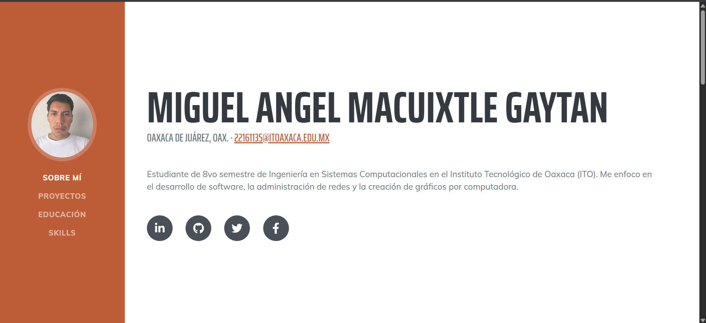
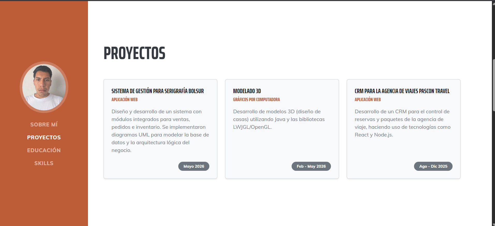
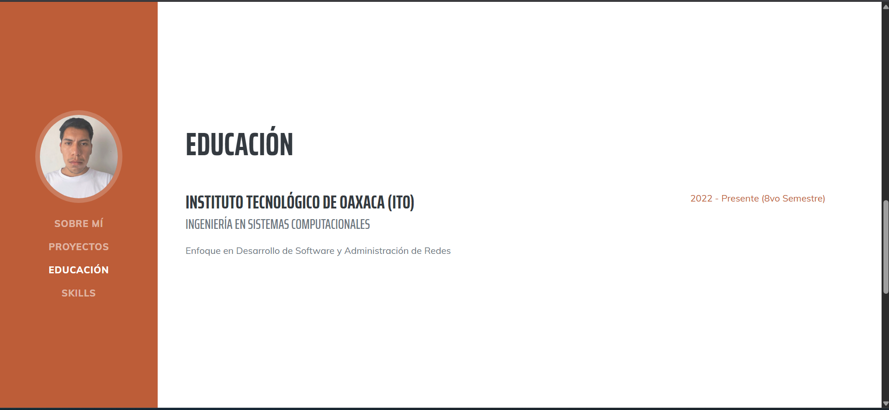
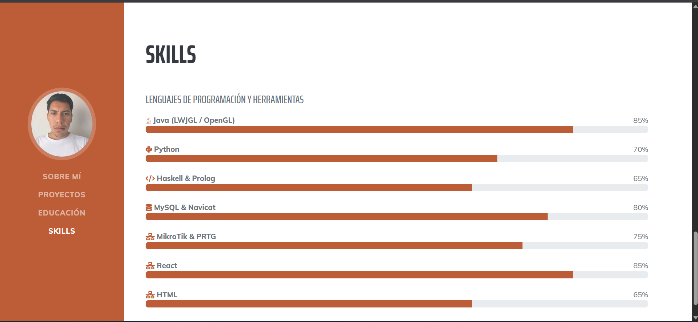

#  Portafolio Web con Bootstrap

### TECNOLÓGICO NACIONAL DE MÉXICO/
### INTITUTO TECNOLÓGICO DE OAXACA

#### Carrera: Ingeniería en Sistemas Computacionales
#### Estudiante: Macuixtle Gaytán Miguel Angel
#### Materia: Programación Web
#### Docente: Martinez Nieto Adelina
#### Unidad: 2
#### Actividad 4: Portafolio Web con Bootstrap
#### Fecha: 06/07/2026

**Descripción:** Este proyecto es un portafolio web personal, responsivo y dinámico, diseñado para mostrar mi información de contacto, proyectos, educación, habilidades técnicas.

---

## Descripción del Proyecto

Este portafolio fue construido utilizando **HTML5, CSS3 y JavaScript vanilla**. 

* **Framework CSS:** Bootstrap.
* **Plantilla base:** [Start Bootstrap - Resume](https://startbootstrap.com/theme/resume)
* **Iconos:** Font Awesome.

### Secciones del Portafolio

El sitio cuenta con diseño responsivo.

1.  **Sobre mí:** Presentación personal, información de contacto directa y enlaces a mis redes profesionales (LinkedIn, GitHub).
2.  **Proyectos:** Exhibición de trabajos prácticos estructurados en tarjetas (Cards), incluyendo un Sistema de Gestión para Serigrafía, Modelado 3D Interactivo y Administración de Redes.
3.  **Educación:** Historial académico actual como estudiante de Ingeniería en Sistemas Computacionales en el ITO.
4.  **Skills:** Representación visual de lenguajes de programación, herramientas de bases de datos y redes, utilizando barras de progreso de Bootstrap para indicar el nivel de dominio.

---

## Proceso de Creación

Para crear este portafolio a partir de la plantilla original, seguí una serie de pasos y modificaciones para darle un aspecto que
se ajustara a mi gusto:

1.  Descargué la plantilla original y eliminé las secciones predeterminadas de "Interests" y "Awards" para mantener un diseño directo y al grano. También renombré las secciones al español.
2.  Reemplacé la lista vertical de experiencia laboral por una cuadrícula de proyectos. Utilicé el sistema de Grid de Bootstrap (`row`, `col-lg-4`) e implementé el componente `Card` con sombras suaves (`shadow-sm`) y bordes redondeados para darle un aspecto moderno.
3.  En lugar de solo tener iconos sueltos, integré el componente `Progress` de Bootstrap. Esto me permitió crear barras horizontales que muestran visualmente el porcentaje de dominio que tengo en diferentes herramientas (Java, Python, MikroTik, etc.).
4.  Renombré los archivos de estilos y scripts originales de la plantilla a `portafolio.css` y `portafolio.js` respectivamente, para cumplir con los lineamientos de la estructura de entrega.

---

## Capturas de pantalla

A continuación se muestra el portafolio funcionando en el navegador:

*Imagen de la seccion sobre mi*

*Imagen de la seccion de mis proyectos*

*Imagen de la seccion de mi educación*

*Imagen de la seccion de mmis skills*
